<!--  -->


## 基于TensorRT-LLM的LLaMA模型优化方案 :zap:
### LLaMA: Open and Efficient Foundation Language Models for TensorRT Hackathon 2023 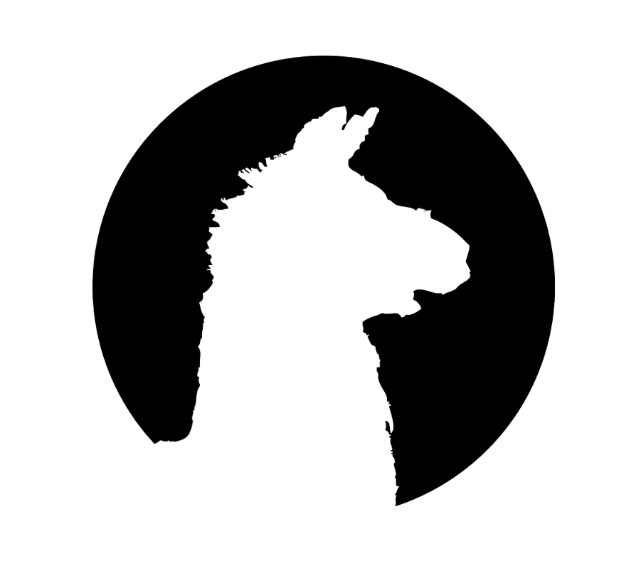

[](https://github.com/NVIDIA/TensorRT)
[](https://tianchi.aliyun.com/competition/entrance/532108/introduction?spm=a2c22.12281957.0.0.4c885d9bOexwJc)
[](https://github.com/NVIDIA/trt-samples-for-hackathon-cn)
[](https://www.bilibili.com/video/BV1jj411Z7wG/?spm=a2c22.12281978.0.0.49ed2274CQCrY7)
[](https://github.com/TRT2022/ControlNet_TensorRT)
[](https://github.com/facebookresearch/llama)


:alien: : **美迪康-北航AI Lab** 

### 0.⏳日志

<div align=center>

|时间点|提交内容|说明|
|-|-|-|
|2023-08-21|和NVIDIA导师团队确定优化方案：基于开源LLM的LLaMA模型推断加速优化|选题|
|2023-08-22|创建Github项目                                              |项目创建|
|2023-08-24|完成送分题作答                                               |送分题 |
|2023-08-31|examples/llama源码学习                                       |项目分析 |
|2023-09-03|正常运行examples/llama                                     |代码运行测试 |
|2023-09-09|examples/llama trick消融实验                                |消融实验 |
|2023-09-17|examples/llama 新feature的实现和测试                          |新feature实现 |
|2023-09-20|README报告书写和代码整理提交                                |报告书写 |

☣️复赛调优阶段：2023年8月17日-9月21日
</div>


### 1.总述
---

作为 [NVIDIA TensorRT Hackathon 2023](https://github.com/NVIDIA/trt-samples-for-hackathon-cn/tree/master/Hackathon2023) 的复赛参赛题目，本工作基于TensorRT-LLM优化大语言模型LLaMA。按照参赛要求本项目选择完成**TensorRT-LLM试用送分题**以及**3+4模式的TensorRT-LLM模型优化方案**，即：
+ 3：用TensorRT-LLM优化examples目录下的某个现有模型（本项目优化`examples/llama`模型）
+ 4：尝试为TensorRT-LLM添加新feature，或者在模型上启用了现有feature

下面我们将从模型介绍，优化效果及如何运行该项目等3个方面介绍本项目

首先是LLaMA模型的相关介绍，[LLaMA](https://github.com/facebookresearch/llama) 是目前为止，效果最好的开源 LLM 之一,数据集层面上共有1.4T的Tokens, tokenizer使用byte pair encoding (BPE) 算法，Sentence-Piece的实现,所有数字被拆分为单独的digit，所有未知的UTF-8 字符，回退到字节来进行分解。因此，LLaMA 可以通过byte 的方式，构造出很多不在 vocab 中的字符，从而也具有较好的多语言能力。网络结构上的改进基于Transformer的架构，并做了如下3点改进：
+ Pre-Normalization：为了提高训练的稳定性，对每个transformer层的输入进行归一化，而不是输出进行归一化（使用 RMS Norm 归一化函数）
+ SwiGLU：使用SwiGLU替代了ReLU作为激活函数。和PaLM中不同，维度采用$\frac{2}{3}4d$而不是$4d$  
+ RoPE：采用旋转位置编码，使得大模型的生成有更好的外推性

LLaMA-7B有32个这样的transformer block构成，LLaMA-13B 优于 GPT-3，尽管只有1/10大小。 LLaMA-65B 是可以与 Chinchilla-70B 和 PaLM-540B 这种最佳的LLM相竞争的模型。经过微调之后，LLaMA的效果有显著的提升。关于LLaMA的介绍，推荐知乎文章：
+ [LLaMA 超详细解读（paper & code）](https://zhuanlan.zhihu.com/p/632102048?utm_id=0)

针对于LLaMA-7B和TensorRT-LLM下的`examples/llama`,我们的优化方案计划实现过程如下图所示：

<div align=center>

</div>

如上图所示，基于`examples/llama`我们实现了：
+ `examples/llama`现有feature的消融实验并基于sight Systems进行了Profiling
+ 实现了`examples/llama`暂未实现的int8 k/v cache和smoothquant
+ 对各种情况进行延时，加速比和精度的对比
+ 初赛阶段在TensorRT官方Repo提交了关了InstanceNorm Plugin的一个bug
+ 送分题的作答
+ 时间关系截止项目提交smoothquant的error问题和inflght batching暂未实现

最终优化效果为：
+ 尝试消融各种feature普遍的TensorRT-LLM的加速比在`1.18-2.74`之间
+ TensorRT-LLM可以很好的把rouge score的差异控制在1以内或左右
+ 新feature int8 k/v cache的测试结果可以正常工作且有一定的加速效果

详细的优化效果请参考section 2和section 3的介绍。

该项目测试运行的软硬件环境请参考section 3.1,下面我们将详细介绍如何逐步运行该项目:

+ 项目结构

<details>
<summary>点我查看项目结构</summary>

```shell
./tensorrt_llm_july-release-v1
├── examples               # 这里存放了了我们的核心代码!
│   ├── bert  
│   ├── bloom
│   ├── chatglm6b
│   ├── cpp_library  
│   ├── gpt               #送分题
│   ├── gptj
│   ├── gptneox
│   ├── lamma            # llamav1-7b feature消融实验
│    ├── build.py        # 构建engine
│    ├── README.md       # readme
│    ├── requirements.txt  # python package requirements
│    ├── run.py          # run tensorrt-llm engine
│    ├── run_hf.py       # run hf model 
│    ├── summarize.py    # 文本摘要测试任务
│    └── weight.py       # build engine过程中加载hf或meta权重文件
|
│   ├── llama_quant      # llama v1-7b 新feature的实现 
│    ├── build.py        # 构建engine 支持int8 k/v cache, smooth quant
│    ├── convert.py      # hf模型转ft模型
│    ├── hf_llama_convert.py # hf模型转ft模型 入口
│    ├── llama_model.py      # tensorrt-llm llama v1-7b 模型结构
│    ├── README.md       # readme
│    ├── requirements.txt # python package requirements
│    ├── run.py          # run tensorrt engine
│    ├── run_hf.py       # run hf model
│    ├── summarize.py    # 文本摘要任务测试
│    ├── check_weight.py # 检查hf模型权重和ft模型权重的一致性
│    ├── quant.py        # smooth quant 替换文件
│    ├── smoothquant.py  # smooth quant的实现
│    └── weight_quant.py # build engine过程中加载ft weight支持int8 k/v cache,smoothquant
|
│   ├── openai_triton      
│   └── opt  
│ 
├── ... # tensorrt_llm_july-release-v1中的其他库文件或代码
│ 
└── README.md  # tensorrt_llm_july-release-v1内的readme
```

</details>

+ 逐步运行方式说明

<details>
<summary>点我查看运行方式</summary>

1.环境准备

```shell
# 拉取镜像 
docker pull registry.cn-hangzhou.aliyuncs.com/trt-hackathon/trt-hackathon:final_v1

# run 镜像
nvidia-docker run -it --name trt2023 registry.cn-hangzhou.aliyuncs.com/trt-hackathon/trt-hackathon:final_v1

# 进入容器中新建临时文件夹,并clone本项目
mkdir temp
cd temp
git clone https://github.com/TRT2022/trtllm-llama

# 进入clone的项目
cd trtllm_llama/tensorrt_llm_july-release-v1/examples

# 将examples中的llama和llama_quant copy替换镜像中的项目
cp -r ./llama /root/workspace/tensorrt_llm_july-release-v1/examples/
cp -r ./llama_quant /root/workspace/tensorrt_llm_july-release-v1/examples/

# 将llama_quant/quant.py文件copy提替换到python package
cd /root/workspace/tensorrt_llm_july-release-v1/examples/llama_quant
cp ./quant.py /usr/local/lib/python3.8/dist-packages/tensorrt_llm/models/quantized/

# 安装必要的python package
pip3 install -r requirements.txt -i  http://mirrors.aliyun.com/pypi/simple/

cd /root/workspace/tensorrt_llm_july-release-v1/examples
```

2.送分题详细见section5

3.尝试运行llama

+ 下载模型

LlaMA-7B v1 (meta checkpoint)模型下载地址： <https://115.com/s/sw6a2kv3w4z?password=a835&#>,将下载后的模型存放在`/tensorrt_llm_july-release-v1/examples/llama/llama-1-7b-meta/`下

+ meta checkpoint 转 huggingface(以下简称HF) checkpoint

```shell
# cd到目标路径
cd ./tensorrt_llm_july-release-v1/examples/llama
# 模型转HF checkpoint
python3 /usr/local/lib/python3.8/dist-packages/transformers/models/llama/convert_llama_weights_to_hf.py  --input_dir ./llama-1-7b-meta --model_size 7B --output_dir ./tmp/llama/7B
```

+ 构建TensorRT-LLM engine

```shell
# 加入plugin
python build.py --model_dir ./tmp/llama/7B/ \
                --dtype float16 \
                --use_gpt_attention_plugin float16 \
                --use_gemm_plugin float16 \
                --output_dir ./tmp/llama/7B/trt_engines/fp16/1-gpu/
```

+ 运行engine

```shell
python3 run.py --max_output_len=50 \
               --tokenizer_dir ./tmp/llama/7B/ \
               --engine_dir=./tmp/llama/7B/trt_engines/fp16/1-gpu/
```

+ 使用LLaMA-7B测试文本摘要任务

```shell
# 使用TensorRT-LLM engine测试
python3 summarize.py --test_trt_llm \
                    --hf_model_location ./tmp/llama/7B/ \
                    --data_type fp16 \
                    --engine_dir ./tmp/llama/7B/trt_engines/fp16/1-gpu/

# 使用HF模型测试
python3 summarize.py --test_hf \
                    --hf_model_location ./tmp/llama/7B/ \
                    --data_type fp16
```

4.llama feature消融实验

```shell
cd /root/workspace/tensorrt_llm_july-release-v1/examples/llama

# ------------k/vcache+attention plugin---------------
# build engine
python3 build.py --model_dir ./tmp/llama/7B/ \
                --dtype float16 \
                --output_dir ./tmp/llama/7B/trt_engines/fp16/1-gpu \
# run engine
run.py --max_output_len=50 \
               --tokenizer_dir ./tmp/llama/7B/ \
               --engine_dir=./tmp/llama/7B/trt_engines/fp16/1-gpu/

# run HF checkpoint
python3 run_hf.py --max_output_len=50 \
               --tokenizer_dir ./tmp/llama/7B/ \
               --hf_model_location ./tmp/llama/7B/

# ----------k/v cache + attention_plugin + weight_only_quant---------
# build engine
python3 build.py --model_dir ./tmp/llama/7B/ \
                --dtype float16 \
                --use_weight_only \
                --output_dir ./tmp/llama/7B/trt_engines/int8_kvcache/1-gpu/

#run engine
python3 run.py --max_output_len=50 \
               --tokenizer_dir ./tmp/llama/7B/ \
               --engine_dir=./tmp/llama/7B/trt_engines/weight_only/1-gpu/

#----k/v cache + attention plugin + weight_only_quant + gemm plugin-----
# build engine
python3 build.py --model_dir ./tmp/llama/7B/ \
                --dtype float16 \
                --use_gpt_attention_plugin float16 \
                --use_gemm_plugin float16 \
                --use_weight_only \
                --output_dir ./tmp/llama/7B/trt_engines/weight_only_attention_gemm/1-gpu/

#run engine
python3 run.py --max_output_len=50 \
               --tokenizer_dir ./tmp/llama/7B/ \
               --engine_dir=./tmp/llama/7B/trt_engines/weight_only_attention_gemm/1-gpu/

#-----------int4 weight only quant--------------
# build engine
python3 build.py --model_dir ./tmp/llama/7B/ \
                --dtype float16 \
                --use_gpt_attention_plugin float16 \
                --use_gemm_plugin float16 \
                --use_weight_only \
                --weight_only_precision int4 \
                --output_dir ./tmp/llama/7B/trt_engines/int4/1-gpu/

#run engine
nsys profile -o trt_llm__int4 python3 run.py --max_output_len=50 \
               --tokenizer_dir ./tmp/llama/7B/ \
               --engine_dir=./tmp/llama/7B/trt_engines/int4/1-gpu/
```

5.llama 新feature的实现

```shell
cd /root/workspace/tensorrt_llm_july-release-v1/examples/llama_quant

#-----------int8 k/v cache---------------
# HF model 转 FT model support int8 k/v cache
python3 hf_llama_convert.py -i tmp/llama/7B \
                            -o ./c-model/llama \
                            --tensor-parallelism 1  \
                            --storage-type float16  \
                             --calibrate-kv-cache 
# build int8 k/v cache engine
python3 build.py --model_dir=./c-model/llama/1-gpu \
                 --use_gpt_attention_plugin float16\
                 --int8_kv_cache \
                 --output_dir=./tmp/llama/7B/trt_engines/int8kv/1-gpu/

# run int8 k/v cache engine
python3 run.py --max_output_len=50 \
               --tokenizer_dir ./tmp/llama/7B/ \
               --engine_dir=./tmp/llama/7B/trt_engines/int8kv/1-gpu/

# summary data test engine
python3 summarize.py --test_trt_llm  \
                     --hf_model_location ./tmp/llama/7B/  \
                     --data_type fp16 \
                     --engine_dir ./tmp/llama/7B/trt_engines/int8kv/1-gpu/

```

```shell
cd /root/workspace/tensorrt_llm_july-release-v1/examples/llama_quant
#---------------smooth quant---------------

# hf model 转 ft model support smooth quant
python3 hf_llama_convert.py -i tmp/llama/7B \
                            -o ./c-model/llama \
                            --tensor-parallelism 1   \
                            --storage-type float16  \
                            --smoothquant 0.5

# build smooth quant model
python3 build.py --model_dir=./c-model/llama/1-gpu \
                 --use_gpt_attention_plugin float16\
                 --use_smooth_quant \
                 --output_dir=./tmp/llama/7B/trt_engines/sm/1-gpu/

```

</details>


### 2.主要开发工作
---

#### 2.1 开发工作的难点

该模型的优化难点如下：

+ 对于TensorRT-LLM相关功能和API不熟悉
+ `examples/llama`中已经实现了多数的feature，在此基础上进一步的优化难度较大

但是，LLaMA作为相对较早的开源大语言模型，其直接影响了国内外大模型的发展和研发思路，其重要性不言而喻，针对于LLaMA的TensorRT-LLM模型优化意义重大。

#### 2.2 开发与优化过程

针对于LLaMA-7B我们的优化过程主要分以下3个部分：
+ 1.初步运行`examples/llama`项目
+ 2.nsight systerm分析逐步添加feature进行消融实验
+ 3.新featute实现：int8 k/v cache, smoothquant和inflight batching

每一部分我们提供了详细的运行脚本和测试结果。

##### 2.2.1 初步运行`examples/llama`项目

0. 准备LLaMA-7B meta checkpoint模型

+ 下载模型

LlaMA-7B v1 (meta checkpoint)模型下载地址： <https://115.com/s/sw6a2kv3w4z?password=a835&#>,将下载后的模型存放在`/tensorrt_llm_july-release-v1/examples/llama/llama-1-7b-meta/`下

+ meta checkpoint 转 huggingface(以下简称HF) checkpoint

```shell
# cd到目标路径
cd ./tensorrt_llm_july-release-v1/examples/llama
# 模型转HF checkpoint
python3 /usr/local/lib/python3.8/dist-packages/transformers/models/llama/convert_llama_weights_to_hf.py  --input_dir ./llama-1-7b-meta --model_size 7B --output_dir ./tmp/llama/7B
```

1. 构建TensorRT-LLM engine

```shell
# 不加入任何trick
python3 build.py --model_dir ./tmp/llama/7B/ \
                --dtype float16 \
                --output_dir ./tmp/llama/7B/trt_engines/fp16/1-gpu \
                --visualize

# 加入plugin
python build.py --model_dir ./tmp/llama/7B/ \
                --dtype float16 \
                --use_gpt_attention_plugin float16 \
                --use_gemm_plugin float16 \
                --output_dir ./tmp/llama/7B/trt_engines/fp16/1-gpu/
```

2. 运行engine

```shell
python3 run.py --max_output_len=50 \
               --tokenizer_dir ./tmp/llama/7B/ \
               --engine_dir=./tmp/llama/7B/trt_engines/fp16/1-gpu/
```

3. 使用LLaMA-7B测试文本摘要任务

```shell
# 使用TensorRT-LLM engine测试
python3 summarize.py --test_trt_llm \
                    --hf_model_location ./tmp/llama/7B/ \
                    --data_type fp16 \
                    --engine_dir ./tmp/llama/7B/trt_engines/fp16/1-gpu/
```
结果：

```
[09/03/2023-13:56:21] [TRT-LLM] [I] ---------------------------------------------------------
[09/03/2023-13:57:32] [TRT-LLM] [I] TensorRT-LLM (total latency: 65.88509821891785 sec)
[09/03/2023-13:57:32] [TRT-LLM] [I] TensorRT-LLM beam 0 result
[09/03/2023-13:57:32] [TRT-LLM] [I]   rouge1 : 19.478572394974464
[09/03/2023-13:57:32] [TRT-LLM] [I]   rouge2 : 5.748473587185184
[09/03/2023-13:57:32] [TRT-LLM] [I]   rougeL : 14.488586709461371
[09/03/2023-13:57:32] [TRT-LLM] [I]   rougeLsum : 17.818188740969955
```

```shell
# 使用HF模型测试
python3 summarize.py --test_hf \
                    --hf_model_location ./tmp/llama/7B/ \
                    --data_type fp16 
```

结果：

```
[09/03/2023-14:02:07] [TRT-LLM] [I] ---------------------------------------------------------
[09/03/2023-14:03:30] [TRT-LLM] [I] Hugging Face (total latency: 78.22841620445251 sec)
[09/03/2023-14:03:30] [TRT-LLM] [I] HF beam 0 result
[09/03/2023-14:03:30] [TRT-LLM] [I]   rouge1 : 20.106338916310662
[09/03/2023-14:03:30] [TRT-LLM] [I]   rouge2 : 5.910110463256421
[09/03/2023-14:03:30] [TRT-LLM] [I]   rougeL : 15.2269090887293
[09/03/2023-14:03:30] [TRT-LLM] [I]   rougeLsum : 17.938095329383458
```

我们初步正常运行了`example/llama`,从结果上初步验证了正确性。

##### 2.2.2 nsight system分析逐步添加feature进行消融实验

该部分我们做了详细的消融实验，通过逐步添加feature和trick的方式验证不同feature在LLaMA-7B上的Latency的收益，并基于nsight system进行profiling。

截止本项目复赛提供的镜像`examples/llama`的feature支持情况如下图所示：

<div align=center>

</div>

由于LLaMA-7B中使用了RoPE,目前`gpt_attention_plugin`(以下简称attention plugin)是目前唯一的一种支持RoPE的方式，因此LLaMA在TensorRT-LLM中强制使用了`gpt_attention_plugin`

1. 添加: k/v cache + attention pligin

+ build engine

```shell
python3 build.py --model_dir ./tmp/llama/7B/ \
                --dtype float16 \
                --output_dir ./tmp/llama/7B/trt_engines/fp16/1-gpu \
```

+ nsight system profiling及latency统计

```shell
# 运行engine
nsys profile -o trt_llm_only_kv_cache_fp16 python3 run.py --max_output_len=50 \
               --tokenizer_dir ./tmp/llama/7B/ \
               --engine_dir=./tmp/llama/7B/trt_engines/fp16/1-gpu/

# 运行HF checkpoint
python3 run_hf.py --max_output_len=50 \
               --tokenizer_dir ./tmp/llama/7B/ \
               --hf_model_location ./tmp/llama/7B/
```

得到结果：

```
# TensorRT-LLM 
llama-run (mean latency: 1.404158673286438 sec)
# HF
llama-hf-run (mean latency: 1.7185083055496215 sec)
```
上述结果显示，添加`k/v cache + attention plugin`后的TensorRT LLaMA的平均推断延时为`1.40416秒`，而HF下平均推断延时为`1.71851秒`,加速比为`1.224`

分析导出的`trt_llm_only_kv_cache_fp16` nsys文件，可以清楚的看到attention plugin和k/v cache以及矩阵乘的推理延时情况如下所示：

+ attention plugin profiling的耗时情况
<div align=center>
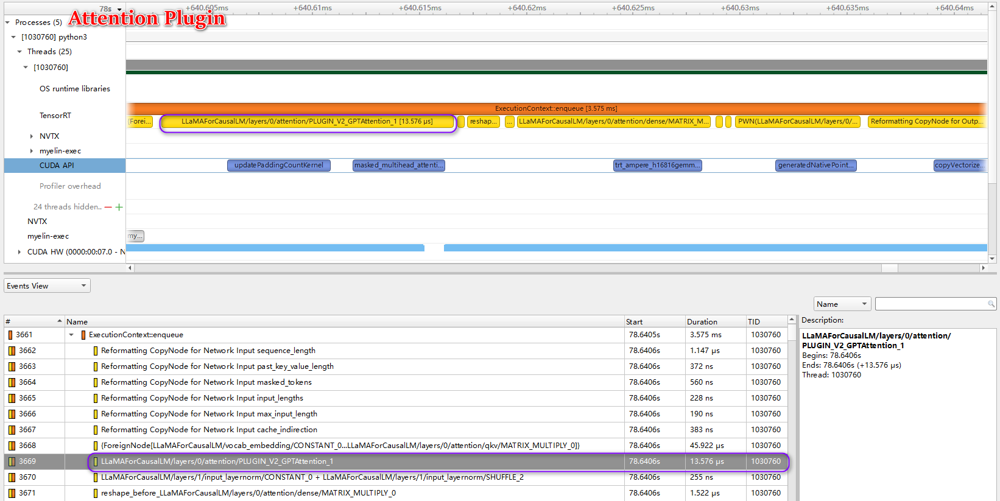
</div>

+ k/v cache profiling的耗时情况

<div align=center>
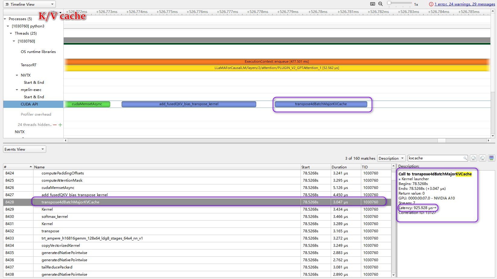
</div>

+ 带权重的矩阵乘的profiling的耗时情况

<div align=center>
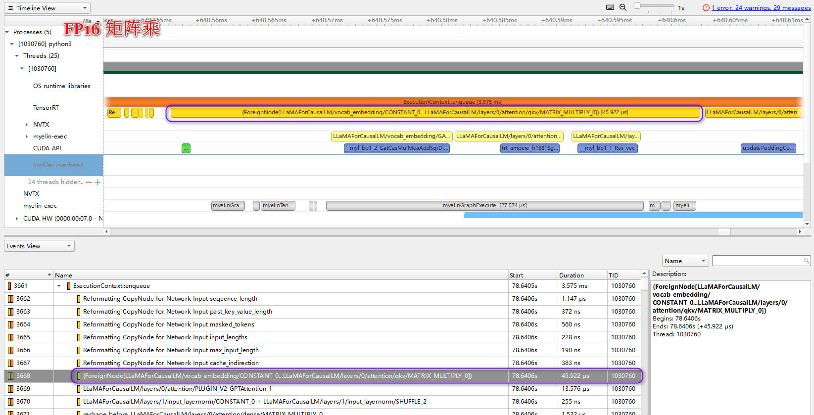
</div>

可以看到在FP16下，attention plugin的latency为$13.576\mu s$,k/v cache的latency为$925.928\mu s$,带权重的矩阵乘的latency为$45.922\mu s$

2. 添加: k/v cache + attention_plugin + weight_only_quant

+ build engine

```shell
python3 build.py --model_dir ./tmp/llama/7B/ \
                --dtype float16 \
                --use_weight_only \
                --output_dir ./tmp/llama/7B/trt_engines/int8_kvcache/1-gpu/
```

+ nsight system profiling及latency统计

```shell
nsys profile -o trt_llm_weight_only python3 run.py --max_output_len=50 \
               --tokenizer_dir ./tmp/llama/7B/ \
               --engine_dir=./tmp/llama/7B/trt_engines/weight_only/1-gpu/
```

得到结果：

```
# TensorRT-LLM 
llama-run (mean latency: 0.7849386262893677 sec)
```
上述结果显示，添加`k/v cache + attention plugin + weight_only_quant`后的TensorRT LLaMA的平均推断延时为`0.78494秒`，而HF下平均推断延时为`1.71851秒`,加速比为`2.189`

分析`trt_llm_weight_only`nsys文件，可以清楚的看到attention plugin和矩阵乘的推理延时情况如下所示：

+ attention plugin profiling的耗时情况
<div align=center>
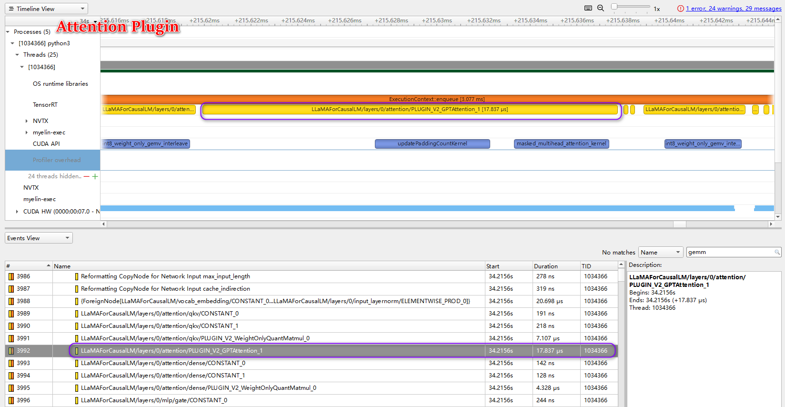
</div>

+ 带权重的矩阵乘的profiling的耗时情况

<div align=center>
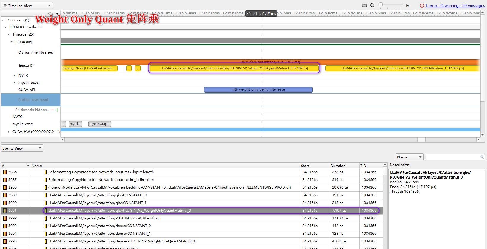
</div>

可以看到在weight only quant下，attention plugin的latency为$17.837\mu s$,带权重的矩阵乘的latency为$7.107\mu s$。对比上述FP16的情况有明显的加速效果。


3. 添加: k/v cache + attention plugin + weight_only_quant + gemm plugin

+ build engine

```shell
python3 build.py --model_dir ./tmp/llama/7B/ \
                --dtype float16 \
                --use_gpt_attention_plugin float16 \
                --use_gemm_plugin float16 \
                --use_weight_only \
                --output_dir ./tmp/llama/7B/trt_engines/weight_only_attention_gemm/1-gpu/

```
+ nsight system profiling及latency统计

```shell
nsys profile -o trt_llm_weight_only_attention_gemm python3 run.py --max_output_len=50 \
               --tokenizer_dir ./tmp/llama/7B/ \
               --engine_dir=./tmp/llama/7B/trt_engines/weight_only_attention_gemm/1-gpu/

```

得到结果：

```
# TensorRT-LLM 
llama-run (mean latency: 0.7930449199676514 sec)
```
上述结果显示，添加`k/v cache + attention plugin + weight_only_quant + gemm plugin`后的TensorRT LLaMA的平均推断延时为`0.79304秒`，而HF下平均推断延时为`1.71851秒`,加速比为`2.167`

分析`trt_llm_weight_only_attention_gemm`nsys文件，可以清楚的看到gemm在使用plugin前后的推理延时情况如下所示：

+ gemm plugin前 profiling的耗时情况

<div align=center>
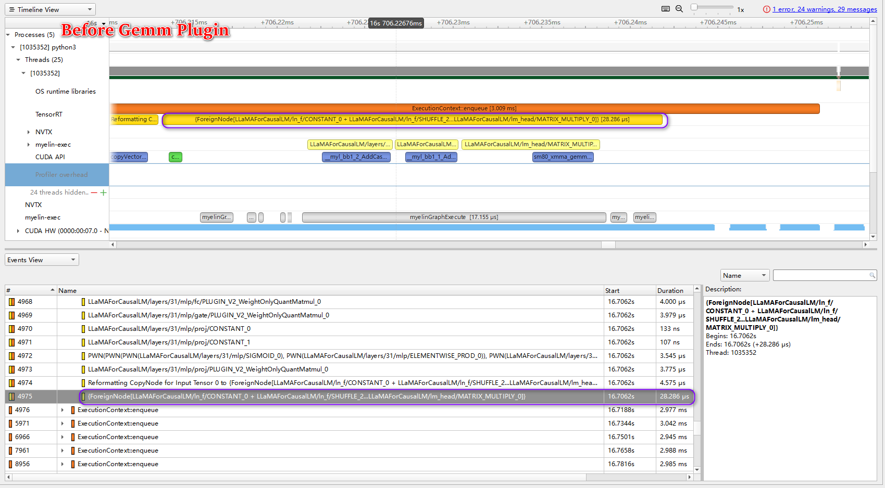
</div>

+  gemm plugin前 profiling的耗时情况

<div align=center>

</div>

可以明显看到替换gemm plugin的前后变化，gemm plugin替换前的latency为$28.286\mu s$,gemm plugin替换后的latency为$26.241\mu s$,有一定的加速效果。

4. int4 weight only quant

+ build engine

```shell
python3 build.py --model_dir ./tmp/llama/7B/ \
                --dtype float16 \
                --use_gpt_attention_plugin float16 \
                --use_gemm_plugin float16 \
                --use_weight_only \
                --weight_only_precision int4 \
                --output_dir ./tmp/llama/7B/trt_engines/int4/1-gpu/

```
+ nsight system profiling及latency统计

```shell
nsys profile -o trt_llm__int4 python3 run.py --max_output_len=50 \
               --tokenizer_dir ./tmp/llama/7B/ \
               --engine_dir=./tmp/llama/7B/trt_engines/int4/1-gpu/
```

得到结果：

```
# TensorRT-LLM 
llama-run (mean latency: 0.48769086837768555 sec)
```

上述结果显示，添加`int4`后的TensorRT LLaMA的平均推断延时为`0.48769秒`，而HF下平均推断延时为`1.71851秒`,加速比为`3.524`

分析`trt_llm__int4`nsys文件，可以清楚的看到attention plugin和k/v cache推理延时情况如下所示：

+ attention plugin profiling的耗时情况
<div align=center>
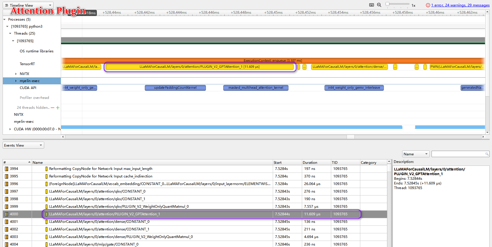
</div>

+ k/v cache profiling的耗时情况

<div align=center>
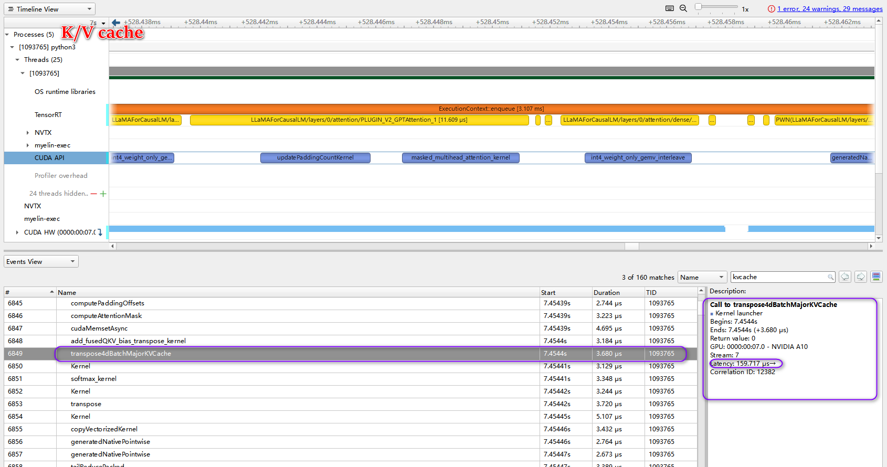
</div>

可以看到在int4下，attention plugin的latency为$11.609\mu s$,K/V cache的latency为$159.717\mu s$

综上基于上述分析结果，总结如下：
<div align=center>
<p>Table-1: Feature与Latency的消融实验(examples/llama现支持的feature)</p>

|Feature|原Llama是否实现|本项目是否启用|batch size|input length|output length|加速比|
|-|-|-|-|-|-|-|
| K/V cache|✔️|✔️|1|8|50|-|
|+Attention Plugin|✔️|✔️|1|8|50|1.224|
|+Weight Only Quant|✔️|✔️|1|8|50|2.189|
|+Gemm Plugin|✔️|✔️|1|8|50|2.167|
|Int4 Weight Only Quant|✔️|✔️|1|8|50|3.524|
|Int8 K/V cache|❌|-|1|8|50|-|
|SmoothQuant|❌|-|1|8|50|-|
|Inflight Batching|❌|-|1|8|50|-|

</div>

⚠️注意：我们将在下一节新feature的实现中进一步完善该表格，并在Section3-优化效果的第一部分提供现有feature下的加速效果和精度对比。

#### 2.2.3 新featute实现：int8 k/v cache,smoothquant，inflight batching

为了体现我们在本项目的工作，我们将新feature的实现单独在`examples`中构建了一个新的项目`examples/llama_quant`

1.int8 k/v cache

<div align=center>
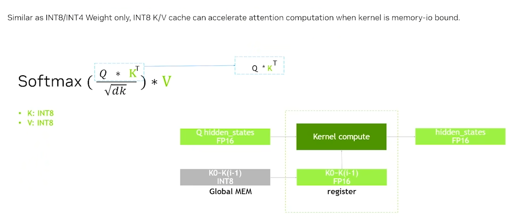
</div>

int8 k/v cache本质和weight only quant一样，在模型generation phase读取之前的K和V类似于weight only quant中全连接层中读取weight,参照weight only quant也把K,V用int8保存下来，当我们真正计算的时候再将其dequant到高精度。

`examples/llama`暂时不支持int8 k/v cache,这里我们实现了`examples/llama`的int8 k/v cache


+ 将HF模型转换为FasterTransformer(以下简称FT)模型

这里我实现了LLaMA-7B的HF模型转换为FT模型，过程中实现了int8 k/v cache.

```shell
cd tensorrt_llm_july-release-v1/examples/llama_quant

python3 hf_llama_convert.py -i tmp/llama/7B \
                            -o ./c-model/llama \
                            --tensor-parallelism 1  \
                            --storage-type float16  \
                             --calibrate-kv-cache 
```
输出如下信息，支持int8 k/v cache的FT模型文件生成完成，生成后的FT模型文件存放在当前路径下的`c-model`文件夹下：

<div align=center>
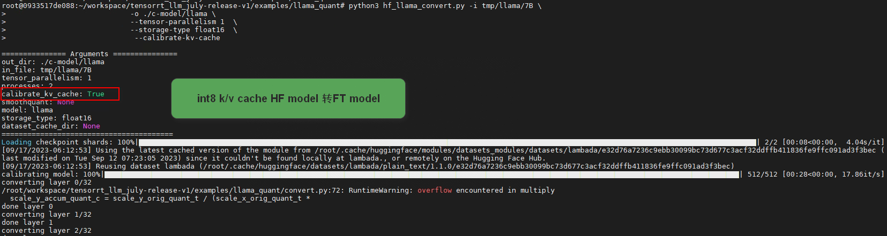
</div>


+ 构建包含int8 k/v cache的engine

这里我们重写了`examples/llama`中的`build.py`,使其可以支持int8 k/v cache

```shell
cd tensorrt_llm_july-release-v1/examples/llama_quant

python3 build.py --model_dir=./c-model/llama/1-gpu \
                 --use_gpt_attention_plugin float16\
                 --int8_kv_cache \
                 --output_dir=./tmp/llama/7B/trt_engines/int8kv/1-gpu/
```

输出如下信息，支持int8 k/v cache的engine序列化完成，并保存在`./tmp/llama/7B/trt_engines/int8kv`下：

<div align=center>
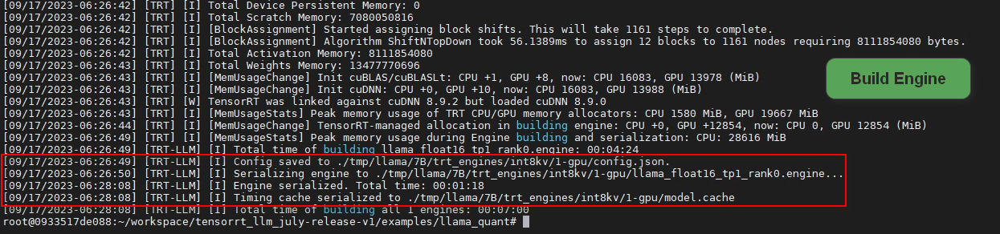
</div>

+ Latency的测试

```shell
cd tensorrt_llm_july-release-v1/examples/llama_quant
python3 run.py --max_output_len=50 \
               --tokenizer_dir ./tmp/llama/7B/ \
               --engine_dir=./tmp/llama/7B/trt_engines/int8kv/1-gpu/
```

其输出结果为：

```
# int8 k/v cache engine
llama-run (mean latency: 1.4051964092254638 sec)
```
`int8 k/v cache + attention plugin`的平均推理延时为`1.40519秒`，上文可知HF下平均推断延时为`1.71851秒`，其加速比为：`1.223`

+ 在文本摘要数据的Latency和精度

```shell
cd tensorrt_llm_july-release-v1/examples/llama_quant
python3 summarize.py --test_trt_llm  \
                     --hf_model_location ./tmp/llama/7B/  \
                     --data_type fp16 \
                     --engine_dir ./tmp/llama/7B/trt_engines/int8kv/1-gpu/
```
输出结果如下：

```
[09/16/2023-12:03:17] [TRT-LLM] [I] ---------------------------------------------------------
[09/16/2023-12:04:28] [TRT-LLM] [I] TensorRT-LLM (total latency: 66.31966018676758 sec)
[09/16/2023-12:04:28] [TRT-LLM] [I] TensorRT-LLM beam 0 result
[09/16/2023-12:04:28] [TRT-LLM] [I]   rouge1 : 18.630357255367613
[09/16/2023-12:04:28] [TRT-LLM] [I]   rouge2 : 5.62976959191806
[09/16/2023-12:04:28] [TRT-LLM] [I]   rougeL : 14.616061481091847
[09/16/2023-12:04:28] [TRT-LLM] [I]   rougeLsum : 16.930935356053094
root@0933517de088:~/workspace/tensorrt_llm_july-release-v1/examples/llama_quant#
```

2.smoothquant

<div align=center>
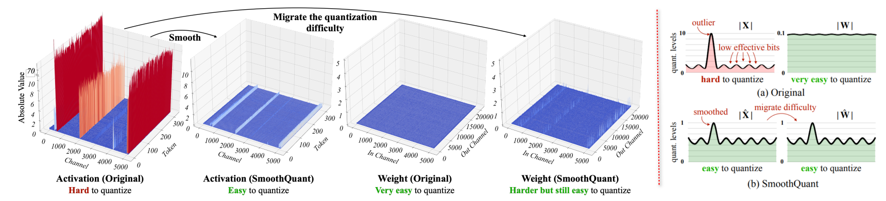
</div>

如上图所示，某些LLM的某些channel或某些维度的activation outlier值很多且很大(ep. GLM-130B有30%），导致量化的有效位变少，比如int8本来是-128到127，没有outlier的时候，映射到-128到127的数据分布均匀，占满了8bit位范围，精度损失很低，但是有了outlier之后，多数正常值的分布区间可能在[-20,20]或者[-10,10]，8bit位范围只利用到了5bit，甚至4bit，由此导致精度损失。上图中的activation红色橙色是outlier，outlier一般集中存在于某几个channel或axis,且activation比weight更难量化，后者数据分布一般比较均匀，smoothquant的keypoints是可以把activation量化难度迁移到weight上来，把activation里面不均匀的分布用weight中和一下，具体来讲，主要是在fp32阶段做的，保证一个等式的等价，$X$为输入activation，$W$为weight，$s$为因子，通过$s$来中和
$$Y=(Xdiag(s)^{-1}.(diag(s)W))=\hat{X}\hat{W}$$
直观的理解如下图所示：
<div align=center>
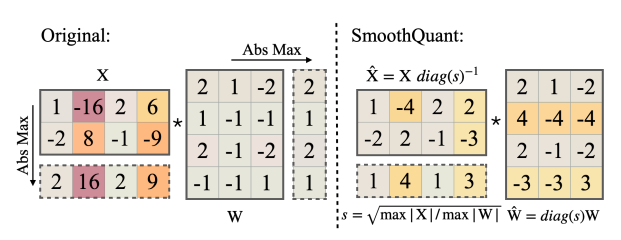
</div>

左边为smooth前，右边为smooth后，可以明显看到X乘以$s^{-1}$之后数据分布明显均匀了，把难度匀了一点给weight。

`examples/llama`暂不支持smoothquant，这里我们实现了`examples/llama`的smoothquant，并将其存放在`examples/llama_quant`项目中

本节中我们首选实现了LLaMA-7B的HF转FT模型并以此实现smoothquant,但在进行build engine的过程中出现了error，时间关系暂未分析出error是bug还是其他代码原因导致。

+ 生成包含smoothquant的FT模型

```shell
cd tensorrt_llm_july-release-v1/examples/llama_quant
python3 hf_llama_convert.py -i tmp/llama/7B \
                            -o ./c-model/llama \
                            --tensor-parallelism 1   \
                            --storage-type float16  \
                            --smoothquant 0.5
```
运行上述代码输出如下，我们成功的将HF模型转换为包含smoothquant的FT模型：
<div align=center>
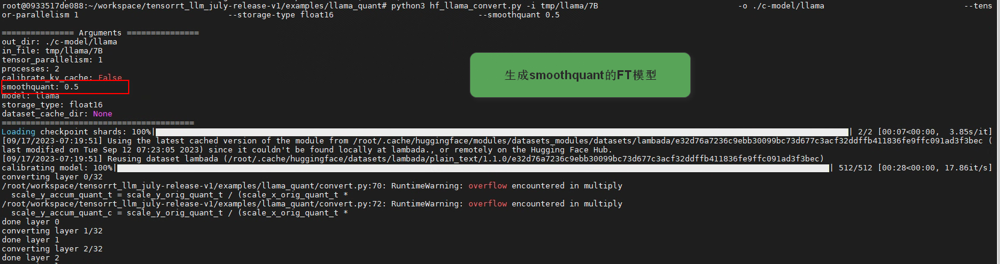
</div>

FT权重文件被存放在`c-model`下，其结构如下图所示：

<div align=center>
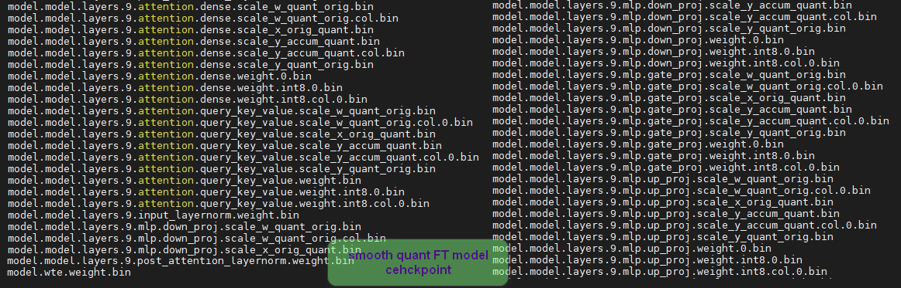
</div>


+ 构建支持smooth quant的engine

```shell
cd tensorrt_llm_july-release-v1/examples/llama_quant
python3 build.py --model_dir=./c-model/llama/1-gpu \
                 --use_gpt_attention_plugin float16\
                 --use_smooth_quant \
                 --output_dir=./tmp/llama/7B/trt_engines/sm/1-gpu/

```

序列化engine过程中，报如下错误：


<div align=center>
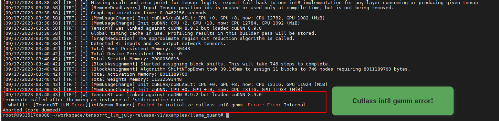
</div>

由于时间关系，我们尝试解决该error但暂时没有解决，我们目前无法确定上述error是否是TensorRT-LLM的bug。


<!-- ```shell
python3 run.py --max_output_len=50 \
               --tokenizer_dir ./tmp/llama/7B/ \
               --engine_dir=./tmp/llama/7B/trt_engines/sm/1-gpu/
``` -->
> 该问题我们将在比赛结束后继续解决！


3.inflight batching (#ToDo)

<div align=center>

</div>

如上图所示，为了增加thoughput我们希望每次推断进batch的数据，对于LLM来说首先需要一个batch的数据中长度不同的sequence进行padding到相同的长度，如上图所示batch size=3,黑色的矩形框表示对每个sequence进行的padding,如果不进行inflight batching操作，一个batch的数据必须全部generate完成才能一起返回，而该bacth中即使有提前generate完成的sequence也必须等待。

inflight batching的过程如上图所示，首先我们创建一个Request Waiting Pool这里存放了所有的待推断的sequence，假设有一个batch的数据padding后经过context phase进行generation phase，batch中的第2个数据提前generate完后即刻返回结果，此时可以在Request Waiting Pool中取出蓝色的新sequence加入到当前batch中，蓝色的sequence执行context phase进而执行generation phase,batch中的其他数据继续执行generation phase。重复上述过程，直到Pool中无需要推断的数据为止。

由于时间关系，本比赛没能实现`examples/llama`项目的inflight batching。我们相信复赛是我们尝试使用TensorRT-LLM的开始，我们将在后期持续完成inflight batching的实现。

综上所述，我们在新feature部分的工作主要包括：

+ 实现了LLaMA-7B HF模型转FT模型及针对于FT模型权重的engine build
+ 基于该模型转换实现了int8 k/v cache并成功序列化engine完成精度和延时的测试
+ 基于该模型转换实现了smoothquant的转换和相应的build engine和精度延时测试的代码部分

待完成的工作：

+ smoothquant在build engine中出现关于`Cutlass int8 gemm`的报错，该错误暂时未被解决，同时在build engine中暂未实现`GateMLP`的smoothquant的核心代码
+ inflight batching暂未实现

最后给出Table-1的补充：
<div align=center>

<p>Table-2: Feature与Latency的消融实验(增加int8 k/v cache，smoothquant, inflight batching)</p>

|Feature|原Llama是否实现|本项目是否启用|batch size|input length|output length|加速比|
|-|-|-|-|-|-|-|
| K/V cache|✔️|✔️|1|8|50|-|
|+Attention Plugin|✔️|✔️|1|8|50|1.224|
|+Weight Only Quant|✔️|✔️|1|8|50|2.189|
|+Gemm Plugin|✔️|✔️|1|8|50|2.167|
|+Int4 Weight Only Quant|✔️|✔️|1|8|50|3.524|
|Int8 K/V cache|❌|✔️|1|8|50|1.223|
|SmoothQuant|❌|✔️|1|8|50|Build Error|
|Inflight Batching|❌|❌|1|8|50|-|

</div>

### 3.优化效果
---

#### 3.1 运行的软硬件环境说明

整个项目的测试软硬件环境如下：

Host硬件环境：
+ CPU: Intel(R) Xeon(R) Platinum 8369B CPU @ 2.90GHz
+ GPU: NVIDIA A10(24G) 
+ 系统： Ubuntu 22.04.2 LTS

Host软件环境：
+ 显卡驱动：Driver Version: 525.105.17 
+ Docker版本： 24.0.5
+ NVIDIA-Docker

Docker镜像:
+ 参考链接：<https://github.com/NVIDIA/trt-samples-for-hackathon-cn/blob/master/Hackathon2023/HackathonGuide.md>
+ 镜像名为: registry.cn-hangzhou.aliyuncs.com/trt-hackathon/trt-hackathon:final_v1
+ TensorRT 9.0 EA 安装目录为: /usr/local/TensorRT-9.0.0.2
+ TensorRT-LLM 代码目录为 /root/workspace/tensorrt_llm_july-release-v1

#### 3.2 推理加速比和模型精度对比

基于上述软硬件环境的测试，我们统计了section2中生成的结果，因为模型显存问题，我们只提供`batch size=1`的结果，其主要包括加速比和精度的比较如下表所示：

<div align=center>

<!-- min input length 251 max input length 923 -->

<p>Table-3: LLaMA-7B TensorRT-LLM加速性能统计表（延时比较）</p>

|model|trick|max input length|output length| beam size|total latency(s)|speedup|
|-|-|-|-|-|-|-|
| HF Model|FP16|923|100|1|78.228|1.000|
| TRT Model|K/V cache++Attention Plugin(FP16)|923|100|1|66.031|1.185|
| TRT Model|+Weight Only Quant(int8)|923|100|1|40.297|1.941|
| TRT Model|+Gemm Plugin(int8)|923|100|1|41.237|1.897|
| TRT Model|+Weight Only Quant(int4)|923|100|1|28.596|2.736|
| TRT Model|Int8 K/V cache|923|100|1|66.319|1.180|

</div>


<div align=center>

<p>Table-4: LLaMA-7B TensorRT-LLM加速性能统计表（精度比较）</p>

|model|trick|max input length|output length| beam size|rouge1 (abs-error)|rouge2(abs-error)|rougeL (abs-error)|rougeLsum (abs-error)|
|-|-|-|-|-|-|-|-|-|
| HF Model|FP16|923|100|1|20.106 (0.000)|5.910 (0.000)|15.226 (0.000)|17.938 (0.000)|
| TRT Model|K/V cache++Attention Plugin(FP16)|923|100|1|18.360 (1.746)|5.591 (0.319)|13.704 (1.522)|16.843 (1.095)|
| TRT Model|+Weight Only Quant(int8)|923|100|1|20.065 (0.041)|6.267 (0.357)|15.433 (0.207)|18.047 (0.109)|
| TRT Model|+Gemm Plugin(int8)|923|100|1|19.881 (0.225)|5.604 (0.306)|14.532 (0.694)|17.530 (0.408)|
| TRT Model|+Weight Only Quant(int4)|923|100|1|18.633 (1.473)|5.434 (0.476)|14.134 (1.092)|16.316 (1.622)|
| TRT Model|Int8 K/V cache|923|100|1|18.630 (1.476)|5.629 (0.281)|14.616 (0.610)|16.930 (1.008)|

</div>

该测试数据来源：`cnn_dailymail`文本摘要数据集，分析上述表格发现增加不同的trick,LLaMA-7B在TensorRT-LLM下的延时和精度的变化，可以清晰的看到TensorRT-LLM可以很好的把rouge score的差异控制在1以内或左右同时有`1.18-2.74`倍的加速比，在int8 k/v cache的测试结果表明我们新增的feature是正常工作的且有一定的加速效果。我们将模型测试过程产生的日志源文件存放在了`test_res`文件夹下。


### 4.Bug报告
---

<div align=center>

|:bug: Bug名称|Issue|是否被官方确认|说明|
|-|-|:-:|-|
|InstanceNormalization Plugin |<https://github.com/NVIDIA/TensorRT/issues/3165>||初赛时提交到TensorRT，我们确定是bug但一直未得到回复|

</div>

### 5.送分题答案
---

> 🔏 问题1：请写出 `./tensorrt_llm_july-release-v1/examples/gpt/README` 里面 `“Single node, single GPU”` 部分如下命令的输出（10分）[模型为gpt2-medium](https://huggingface.co/gpt2-medium) 

```shell
python3 run.py --max_output_len=8 
```
<details>
<summary>🔑点我查看 问题1 解析</summary>

0. 必要的Python Package安装

```shell
cd ./tensorrt_llm_july-release-v1/examples/gpt
pip3 install requirements.txt -i https://mirrors.aliyun.com/pypi/simple
```

1. 下载HuggingFace(HF)模型

```shell
# 下载HF模型
rm -rf gpt2 && git clone https://huggingface.co/gpt2-medium gpt2

# 更新.bin模型
cd gpt2
rm pytorch_model.bin model.safetensors
wget https://huggingface.co/gpt2-medium/resolve/main/pytorch_model.bin
cd ..
```
2. 将HF weight转为FT weight

TensorRT-LLM 可以直接加载FastTransformer(FT)格式的模型weight文件，因此需要将HF weight转换为FT weight

```shell
python3 hf_gpt_convert.py -i gpt2 -o ./c-model/gpt2 --tensor-parallelism 1 --storage-type float16
```
运行上述代码，log中出现如下图所示结果，说明模型转换完成，并在`tensorrt_llm_july-release-v1/examples/gpt/c-model/gpt2/1-gpu`中存放了生成后的FT weight

<div align=center>
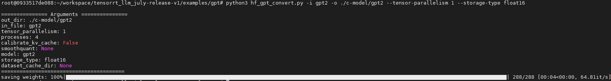
</div>

3. 构建TensorRT-LLM engine

TensorRT-LLM engine的构建过程使用了FT weight和对应的配置文件（已经在第2步生成）和自定义的Tokenizer。过程中如果不指定模型权重路径，TensorRT-LLM默认随机初始化这些weight生成engine。

```shell
# single GPU float16 使用FT weight生成engine
python3 build.py --model_dir=./c-model/gpt2/1-gpu --use_gpt_attention_plugin
```
执行上述代码，log中出现如下所示结果，说明模型序列化完成，并将engine保存在`./tensorrt_llm_july-release-v1/examples/gpt/gpt_outputs`中

```
[08/24/2023-07:07:38] [TRT-LLM] [I] Total time of building gpt_float16_tp1_rank0.engine: 00:00:35
[08/24/2023-07:07:38] [TRT-LLM] [I] Config saved to gpt_outputs/config.json.
[08/24/2023-07:07:38] [TRT-LLM] [I] Serializing engine to gpt_outputs/gpt_float16_tp1_rank0.engine...
[08/24/2023-07:07:42] [TRT-LLM] [I] Engine serialized. Total time: 00:00:04
[08/24/2023-07:07:42] [TRT-LLM] [I] Timing cache serialized to gpt_outputs/model.cache
[08/24/2023-07:07:42] [TRT-LLM] [I] Total time of building all 1 engines: 00:00:50
```
⚠️注意： `build.py`支持多GPU并行构建TensorRT-LLM engine,详细的可以参考：`./tensorrt_llm_july-release-v1/examples/gpt/README`

4. Single node,single GPU下测试engine

```shell
# single GPU下运行engine
python3 run.py --max_output_len=8
```
运行上述代码，log中输出结果如下：

```
Input: Born in north-east France, Soyer trained as a
Output:  chef and eventually became a chef at a
```
问题1解析完成。

⚠️注意：`run.py`支持single node multiple GPUs(基于`mpirun`)和multiple nodes,multiple GPUs(基于[Slurm](https://slurm.schedmd.com))，详细的可以参考`./tensorrt_llm_july-release-v1/examples/gpt/README`

</details>


> 🔏 问题2: 请写出 `./tensorrt_llm_july-release-v1/examples/gpt/README` 里面 `“Summarization using the GPT model”` 部分如下命令的rouge 分数（10分）[模型为gpt2-medium](https://huggingface.co/gpt2-medium)

```shell
python3 summarize.py --engine_dirtrt_engine/gpt2/fp16/1-gpu --test_hf  --batch_size1  --test_trt_llm  --hf_model_location=gpt2 --check_accuracy --tensorrt_llm_rouge1_threshold=14
```

<details>
<summary>🔑点我查看 问题2 解析</summary>

该问题将描述如何使用TensorRT-LLM运行一个文本摘要任务的GPT-2,这里使用的数据集为[cnn_dailymail](https://huggingface.co/datasets/cnn_dailymail) ，对应生成的摘要使用[ROUGE](https://en.wikipedia.org/wiki/ROUGE_(metric)) score来评价TensorRT-LLM的精度变化，确切的说这里使用了`ROUGE-1` score。

关于评价指标[ROUGE](https://en.wikipedia.org/wiki/ROUGE_(metric))的介绍，我们推荐参考知乎的介绍：

+ [中文文本摘要指标-ROUGE](https://zhuanlan.zhihu.com/p/388720967)
+ [NLP评估指标之ROUGE](https://zhuanlan.zhihu.com/p/504279252)

问题1中已经完成了必要的package的安装，这里直接下载HF模型

1. 下载HF模型文件

```shell
# 下载模型文件
rm -rf gpt2 && git clone https://huggingface.co/gpt2 gpt2

# 更新.bin模型文件
cd gpt2
rm pytorch_model.bin model.safetensors
wget https://huggingface.co/gpt2/resolve/main/pytorch_model.bin
cd ..
```

2. 将HF weight转换为FT weight

```shell
python3 hf_gpt_convert.py -i gpt2 -o ./c-model/gpt2/fp16 --tensor-parallelism 1 --storage-type float16
```

运行上述代码，log中出现如下图所示结果，说明模型转换完成，并在`tensorrt_llm_july-release-v1/examples/gpt/c-model/gpt2/fp16/1-gpu`中存放了生成后的FT weight

<div align=center>
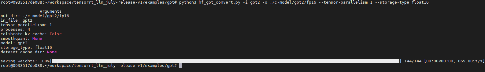
</div>

3. 构建TensorRT-LLM engine

```shell
python3 build.py --model_dir=./c-model/gpt2/fp16/1-gpu \
                 --use_gpt_attention_plugin \
                 --use_gemm_plugin \
                 --use_layernorm_plugin \
                 --max_batch_size 8 \
                 --max_input_len 924 \
                 --max_output_len 100 \
                 --output_dir trt_engine/gpt2/fp16/1-gpu/ \
                 --hidden_act gelu
```

执行上述代码，log中出现如下所示结果，说明模型序列化完成，并将engine保存在`./tensorrt_llm_july-release-v1/examples/gpt/trt_engine/gpt2/fp16/1-gpu`中

```
[08/24/2023-07:34:42] [TRT-LLM] [I] Total time of building gpt_float16_tp1_rank0.engine: 00:01:32
[08/24/2023-07:34:42] [TRT-LLM] [I] Config saved to trt_engine/gpt2/fp16/1-gpu/config.json.
[08/24/2023-07:34:42] [TRT-LLM] [I] Serializing engine to trt_engine/gpt2/fp16/1-gpu/gpt_float16_tp1_rank0.engine...
[08/24/2023-07:34:43] [TRT-LLM] [I] Engine serialized. Total time: 00:00:01
[08/24/2023-07:34:43] [TRT-LLM] [I] Timing cache serialized to trt_engine/gpt2/fp16/1-gpu/model.cache
[08/24/2023-07:34:43] [TRT-LLM] [I] Total time of building all 1 engines: 00:01:43
```

4. TensorRT-LLM下测试GPT-2文本摘要任务

```shell
python3 summarize.py --engine_dir trt_engine/gpt2/fp16/1-gpu \
                     --test_hf \
                     --batch_size 1 \
                     --test_trt_llm \
                     --hf_model_location=gpt2 \
                     --check_accuracy \
                     --tensorrt_llm_rouge1_threshold=14
```
执行上述代码，结果如下：

```
[08/24/2023-08:40:54] [TRT-LLM] [I] ---------------------------------------------------------
Downloading builder script: 5.60kB [00:00, 6.22MB/s]
Token indices sequence length is longer than the specified maximum sequence length for this model (1151 > 1024). Running this sequence through the model will result in indexing errors
[08/24/2023-08:41:14] [TRT-LLM] [I] TensorRT-LLM (total latency: 2.6481666564941406 sec)
[08/24/2023-08:41:14] [TRT-LLM] [I] TensorRT-LLM beam 0 result
[08/24/2023-08:41:14] [TRT-LLM] [I]   rouge1 : 15.361040799540035
[08/24/2023-08:41:14] [TRT-LLM] [I]   rouge2 : 3.854022269668396
[08/24/2023-08:41:14] [TRT-LLM] [I]   rougeL : 12.078455591738333
[08/24/2023-08:41:14] [TRT-LLM] [I]   rougeLsum : 13.547802733617264
[08/24/2023-08:41:14] [TRT-LLM] [I] Hugging Face (total latency: 10.39808702468872 sec)
[08/24/2023-08:41:14] [TRT-LLM] [I] HF beam 0 result
[08/24/2023-08:41:14] [TRT-LLM] [I]   rouge1 : 14.75593024343394
[08/24/2023-08:41:14] [TRT-LLM] [I]   rouge2 : 3.3647470801871733
[08/24/2023-08:41:14] [TRT-LLM] [I]   rougeL : 11.124766996533
[08/24/2023-08:41:14] [TRT-LLM] [I]   rougeLsum : 13.031128048110618
```

<div align=center>
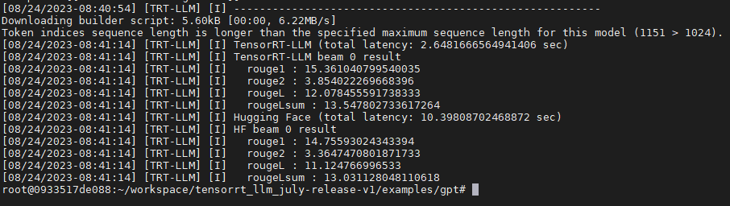
</div>

问题2解析完成。

⚠️注意：过程中需要下载数据，如果运行过程中中断或报错大多是因为网络原因，请耐心多尝试重复运行几次

</details>


### 6.未来工作
---

LLM可以肯定的是当前和未来AI深入研究和产品化的重要研究方向，越来越多的企业和研究机构也在致力研究LLM的加速推理框架，TensorRT-LLM作为新一代的基于TensorRT 9.0的LLM的推理加速框架，给大模型的部署提供了高效可行的方案。TensorRT-LLM集成了主流的LLM模型加速的方案包括：（int8) k/v cache, weight only quant, smooth quant, inflight batching及各种高效的Plugin。比赛过程中我们需要细致的研究TensorRT-LLM的实现方式，熟悉TenserRT-LLM的构建逻辑，这花费我们大量的时间和精力，加之对TensorRT-LLM的熟悉程度不够导致我们无法在短时间实现我们规划的新Feature的实现，比如smoothquant的build engine的error问题，inflight batching的feature的实现等等。未来我们将持续关注TensorRT-LLM的进展，实现上述遗留的问题，并期待正式版本的TensorRT-LLM的发布。

### 7.😉References
---

1. [TensorRT(Github)](https://github.com/NVIDIA/TensorRT)

2. [trt-samples-for-hackathon-cn](https://github.com/NVIDIA/trt-samples-for-hackathon-cn)

3. [NVIDIA TensorRT Hackathon 2023 —— 生成式AI模型优化赛(天池)](https://tianchi.aliyun.com/competition/entrance/532108/introduction?spm=a2c22.12281957.0.0.605a3b74bkLhBT)

4. [TensorRT 8.6 讲座(B站)](https://www.bilibili.com/video/BV1jj411Z7wG/)

5. [Llama(Github)](https://github.com/facebookresearch/llama)

6. [Llama paper (arxiv)](https://arxiv.org/abs/2302.13971)

7. [TensorRT-LLM:大语言模型推理：低精度最佳实践(B站)](https://www.bilibili.com/video/BV1h44y1c72B/?share_source=copy_web&vd_source=db3eecb1b88cc6c7a18eeaf6db1ed114)

8. [TensorRT-LLM大语言模型推理：优化关键技术解析(B站)](https://www.bilibili.com/video/BV1j44y1c7fT/?spm_id_from=333.788&vd_source=def8c63d9c5f9bf987870bf827bfcb3d)

9. [SmoothQuant(arxiv)](https://arxiv.org/abs/2211.10438)


